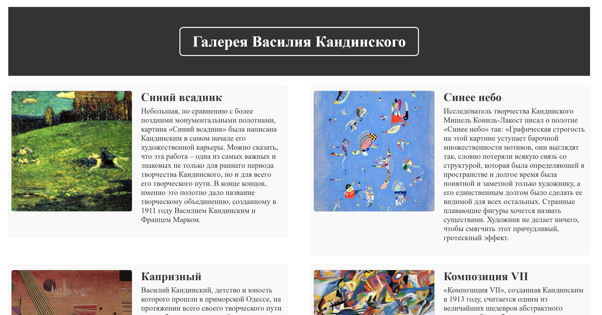
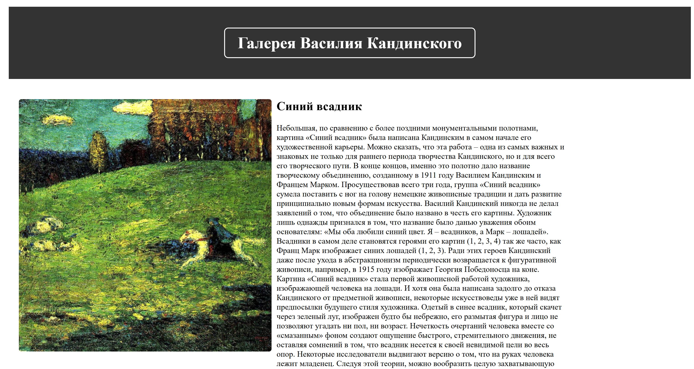

# Kandinsky Art Gallery




A static web gallery dedicated to the artworks of Wassily Kandinsky.

The project presents a collection of Kandinsky's paintings with individual pages containing artwork images and descriptions. The website focuses on clean structure, simple navigation, and a consistent visual style.

## Preview

The gallery includes a main page with a collection of artworks and separate pages for each painting.

### Featured artworks

- The Blue Rider
- Blue Sky
- Capricious
- Composition VII
- Composition VIII
- Improvisation No. 20 (Two Horses)
- The Structure of the Corners
- Two Men on a Horse

## Technologies

- **HTML5** — page structure and semantic markup
- **CSS3** — styling, layout, transitions, and visual effects

## Features

- Gallery-style main page with artwork previews
- Individual pages for each painting
- Artwork descriptions
- Navigation between paintings
- Navigation back to the main gallery
- Hover effects on images and links
- Smooth scrolling
- Responsive image handling with `object-fit`
- Semantic HTML structure
- Email contact link

## Project Structure

```text
kandinsky-gallery/
│
├── index.html
├── blue_horseman.html
├── blue_sky.html
├── capricious.html
├── composition_VII.html
├── composition_VIII.html
├── improvisation_no_20_two_horses.html
├── the_structure_of_the_corners.html
├── two_men_on_a_horse.html
│
├── style.css
│
├── images/
│   ├── blue_horseman.jpg
│   ├── blue_sky.jpg
│   ├── capricious.jpg
│   ├── composition_VII.jpg
│   ├── composition_VIII.jpg
│   ├── improvisation_no_20_two_horses.jpg
│   ├── the_structure_of_the_corners.jpg
│   └── two_men_on_a_horse.jpg
│
└── descriptions/
    └── artwork descriptions
```
